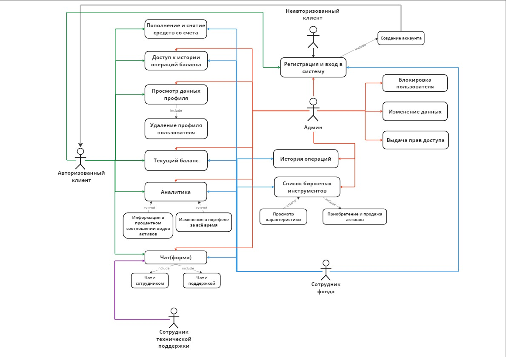

# 0. От себя

Идея украдена с Тинькофф инвестиций, поэтому можете отталкиваться от них и по любым вопросам писать в лс.

Также расход на написание данного тз составил 1л пива на 100 строк или 1 схему, цените чужой труд и не возмущайтесь сильно громко, а то буду требовать компенсацию

В данной версии тз фактически все задачи будут написаны в функционале для каждого пользователя, однако вдальнейшем я планирую раскидать их по функциональным блокам, оставив лишь описание действий в функциях пользователей.

# 1. Цель проекта

Вы являетесь руководителем аналитического центра инвестиционной

компании, занимающейся вложением денежных средств в ценные бумаги.
Ваши клиенты – предприятия, которые доверяют управлять их свободными
денежными средствами на определенный период. Вам необходимо выбрать
вид ценных бумаг, которые позволят получить прибыль и компании, и
клиенту. При работе с клиентом для вас весьма существенной является
информация о предприятии – название, вид собственности, адрес и телефон.

# 2. Описание системы

В следующих версиях тз данные будут более удобно укомплектованы, однако если текущая версия не доставляет дискомфорт, то могу и так оставить

Система состоит из следующих функциональных блоков:

1. Регистрация, аутентификация и авторизация
2. Функционал для каждого пользователя
3. Функционал пополнения и снятия средств с баланса клиента
4. Реализация аналитики:
   1. Краткая аналитика клиента
   2. Полная аналитика клиента
5. Личный кабинет
6. Выбор клиентского портфеля, с которым будет работать сотрудник
7. История:
   1. Финансовых операций с счётом
   2. Купли-продаж активов
8. Купли-продажа активов(если все совсем круто будете успевать, добавим поиск по списку активов)
9. Обратная связь между пользователями

## 2.1. Типы пользователей

Система предусматривает пять типов пользователей системы:

### 1. Неавторизированный клиент

### 2. Авторизированный клиент

### 3. Сотрудник

### 4. Админ

Неавторизированный клиент имеет возможность только зарегистрироваться, после чего он становится авторизированным клиентом. Последний имеет следующие права:

- пополнять и снимать деньги со своего счета
- просматривать свою историю действий первого пункта
- просматривать данные профиля, но не редактировать их
- удалить аккаунт
- просматривать аналитику портфеля(как ввиде диаграммы, так и процентный рост и т.д.)
- обратная связь с брокером и поддержкой(в текущей реализации это чат)

## 2.2. Регистрация

Предусмотренные поля:

- email
- пароль(не меньше 8 символов)
- input radio: клиент, сотрудник, админ
- ФИО
- пол
- номер телефона
- дата рождения
- адрес проживания
- серия и номер паспорта
- кличка любимого кота(реализуется только на фронте, но если вам в прикол, можно как полноценную дотянуть)

Важно проверить, чтобы почта, паспортные данные, пароль и номер телефона не присутствовали у других клиентов

## 2.3. Аутентификация

Аутентификация пользователя осуществляется по email и
паролю

## 2.4. Функционал для клиента

Клиент после аутентификации (ввода логина и пароля) получает доступ к
своему функционалу в Системе. Этот функционал состоит из
следующих блоков:

1. Главная страница
2. Финансовый операции с балансом
3. Просмотр финансовых операций с балансом
4. Краткая аналитика
5. Расширенная аналитика
6. Личный кабинет
7. Обратная связь

### 2.4.1. Главная страница

В этом разделе у клиента есть возможность просмотра баланса в рублях. Сам баланс является суммой остатка средств на счету и совокупной стоимости активов на текущий момоент. Под ним находится изменение баланса в процентах и в рублях, которое вычисляется на основе общей прибыли от текущих активов - стоимости активов на момент их покупки. Далее идут три кнопки - пополнение, снятие средств и история финансовых операций, выполненные в минималистичном стиле.

Далее идет краткая аналитика.

Ниже идет кнопка, позволяющая перейти на расширенную аналитику.

В правом верхнем углу личный кабинет.

В правом нижнем углу кнопка обратной связи, которая при поступлении нового сообщения должна будет изменяться, пока на нее не нажмут.

### 2.4.2. Финансовый операции с балансом

К каждой обработке стоит сохранять время операции для дальнейшего использования и все данные по операциям вносить в бд для дальнейшего использования.

В случае с пополнении баланса появляется форма содержащая сумму пополнения и реквизиты банковской карты с возможностью запоминания(кроме CVV).

Т.к. реальный кошелек мы решили не привязывать, то просто происходит изменение баланса на запрошенную сумму.

В случае с снятием средств форма является обращением клиента к финансовому агенту, которая содержит поля:

- Сумма на вывод
- время по истечении которого запрошенная сумма должна быть отправлена на счет клиента (input radio минимальная 8h, дальше на свое усмотрение)
- реквизиты карты с возможностью запоминания

### 2.4.3. Просмотр финансовых операций с балансом

При нажатии на кнопку просмотра истории под балансом, клиент переходит на другую страницу, оформленную как операции по счету в любом банке, но записи идут монолитно и не разделяются другими записями: слева сумма изменения баланс, справа время изменения.

### 2.4.4. Краткая аналитика

При рассчете диаграмм опираемся на акутальную стоимость активов, а не на их количество.

Краткая аналитика представляет из себя 2 cхемы:

1. Круговая диаграмма о процентном соотношении видов ценных бумаг в портфеле (акции, облигации, фонды, металлы, валюта)

2. Стольбцовая диаграмма отражающая изменения баланса портфеля за все время его существования

(если есть возможность и время будет здорово сделать доступным просмотр баланса за 1 месяцев, за 6 месяцев, за год и за все время)

### 2.4.1.5. Расширенная аналитика

Расширенная аналитика представляет из себя отдельную страницу.

Для каждого актива создан блок аналогичный краткой аналитике, несущий данные по соответствующему активу, а также выше выводящий суммарную стоимость соответствующего актива в портфеле.

### 2.4.6. Личный кабинет

ЛК представляет из себя заполненные в две колонки формы, под которыми находится краткая форма с удалением аккаунта. При нажатии появляется дополнительная форма "уверены ли вы", по итогом которой все данные пользователя полностью стираются с бд, а пользователь переходит на страницу входа/регистрации.

### 2.4.7. Обратная связь.

Реализуем в последнюю очередь.

Необходимо создать чат. При нажатии на кнопку чата он открывается и занимает примерно треть высоты и ширины страницы(ввиду адаптивности верстки этот процент увеличивается до 100 на мобилке).

Над полем ввода формата т9 находятся 2 кнопки с прозрачным фоном, которые при наведении обретают цвет фона. При нажатии образуется связь с бд сотрудника/поддержки, в зависимости от того, на какую кнопку наж али. Далее в поле вводится текст, который сохраняется в бд отправителя вместе с временем оформления. Аналогичные данные поступают получателю. При открытии данных воспроизводится история чата. Чат обновляется только при обновлении страницы.
Данные отправляются только при нажатии на соответственную кнопку.

Альтернативный вариант реализации:

Создание кнопки, идейно схожей с чатом, которая отправляется письмо на почту, где и предполагается дальнейшее общение. Примите общее решение и свяжитесь со мной.

Варианты для улучшения чата (т.к. в текущий момент это главная идея):

- обновление истории чата каждые 5 секунд, чтобы не обновлять страницу для получения нового сообщения.

## 2.5 Функционал для сотрудника

Сотрудник после аутентификации (ввода логина и пароля) получает доступ к
своему функционалу в Системе. Этот функционал состоит из
следующих блоков:

1. Главная страница
2. История операций клиентов (доп задание: реализация фильтра по клиентам по ФИО)
3. Просмотр финансовых операций с балансом
4. Выбор клиентского аккаунта
5. Главная страница клиента
6. Личный кабинет
7. Обратная связь
8. История торговли
9. Торговля

### 2.5.1. Главная страница

В этом разделе у сотрудника есть возможность выбора клиентского аккаунта из списка, первоначально сформированного из двух столбцов. Каждый блок - краткое ФИО клиента и аналогия баланса, реализованного у клиента, но без кнопок и содержащая только процентное изменение баланса.

Над списком клиентов должна располагаться кнопка для просмотра истории операций клиентов.

В правом верхнем углу личный кабинет.

В правом нижнем углу кнопка обратной связи, которая при поступлении нового сообщения должна будет изменяться, пока на нее не нажмут.

### 2.5.2. История операций клиентов

Аналогично пункту 2.4.1.3, однако история должна быть сформированна из действий абсолютно всех клиентов, к которым подключен сотрудник.

### 2.5.3. Просмотр финансовых операций с балансом

Аналогично клиентской версии, но для выводятся данные только выбранного клиента

### 2.5.4. Выбор клиентского аккаунта

В середине главной страницы должен располагаться список из клиентов, к которым подключен сотрудник (**важнейшее доп задание:** реализовать подключение клиента к сотруднику. Если будем реализовывать - допишу). Это уже было расписано в 2.4.2.1.. Далее сотрудник попадает "на аккаунт клиента", с единственным отличием в кнопке каталога активов

### 2.5.5. Главная страница клиента

Основано на 2.4.1.1.
Различия в реализации:

1. ЛК переходит на сотрудника
2. Чат копипастим умом)
3. Отсутствуют операции с изменением количества средств на балансе
4. Появляется кнопочка торговли

### 2.5.6 Личный кабинет

Абсолютно аналогично пользователю, за исключением возможности удаления аккаунтов, в бд различаем права доступа при помощи дополнительной записи

### 2.4.2.7. Обратная связь

Аналогично клиенту, но связь уже будет сотрудника с клиентом

### 2.5.8 История торговли

При нажатии на кнопку просмотра истории под балансом, сотрудник переходит на другую страницу, оформленную как история операций с портфелем(пример ниже), но записи идут монолитно и не разделяются другими записями: слева img_logo, название актива, сумма изменения баланса, справа время изменения.

### 2.5.9 Торговля

После нажатия на кнопку каталога пользователь переходит в список активов, где он может выбрать один из 5 доступных видов активов:

1. Акции
2. Облигации
3. Фонды
4. Металлы и валюты

После выбора вида активов появляется список из активов, где каждый блок имеет следующий вид:
тикер, название актива, стоимость, (доп задание: добавить изменение цены в течении определенного периода времени)

Список активов:

1. Акции

- Лукойл
- Сбер
- ГК Самолёт
- Магнит
- Positive Technologies
- Novabev Group
- Ozon
- ФосАгро
- АЛРОСА
- Мать и дитя

2. Облигации

- ОФЗ 26238
- ОФЗ 26243
- ОФЗ 26225
- О'КЕЙ 001P-06
- Делимобиль 1Р-03
- М. Видео выпуск 3
- ВИС Финанс выпуск 1
- Газпром Капитал БЗО26-1-Е
- ГТЛК ЗО28рД

3. Фонды

- Тинькофф Вечный портфель
- Тинькофф Золото
- Тинькофф IMOEX
- ВИМ Ликвидность
- ВИМ Фонд Золото
- ВИМ Индекс Московской биржи
- Альфа-Капитал Управление
- Альфа-Капитал Золото
- АТОН Российские акции

4. Металлы и валюта

- Золото
- Серебро
- Доллар США
- Евро
- Китайский юань
- Гонконгский доллар
- Турецкая лира

При нажатии на соответствующий актив, сотрудник переходит на страницу торговли. В центре находится график, под ним 2 кнопки: купить и продать. Между ними количество акций, выбранное для данных действий. Над этим полем расположенно текущее количество приобретенных активов и процент доходности. Если активы отсутствуют, запись также будет отсутствовать(упрощенная реализация - пусть будет 0 акций).

При продаже в бд уменьшается количество акций, приобретенных на данный момент.
При покупке считается средняя стоимость 1 единицы актива на данный момент и заменяет эту запись в бд.

Должна осуществляться проверка, хвататет ли средств на балансе пользователя для совершения транзакции.

Кроме того, при совершении транзакции необходим вычет комиссии биржи(0.04%), а также нашей комиссии при продаже, которая составляет 25% от чистой прибыли сделки.

Этот параграф скорее всего будет дописываться и видоизменяться

## 2.6. Функционал для админа

Админ после аутентификации (ввода логина и пароля) получает доступ к
своему функционалу в Системе. Этот функционал состоит из
следующих блоков:

1. Главная страница
2. Личный кабинет админа
3. Выбор пользовательского аккаунта
4. Главная страница пользователя
5. Просмотр истории изменения баланса
6. История торговли
7. Личный кабинет пользователя
8. Каталог приобретенных активов
9. Обратная связь

### 2.6.1. Главная страница

Схоже с 2.5.1

В этом разделе у админа есть возможность выбора пользовательского аккаунта из списка, первоначально сформированного из двух столбцов. Слева клиента, справа сотрудники. В мобильной версии сначала список клиентов, отступ, список сотрудников. Для каждого пользователя достаточно вывести его ФИО. Дизайнеру желательно разделить цветом сотрудника и клиента.

В правом верхнем углу личный кабинет админа.

В правом нижнем углу кнопка обратной связи, которая при поступлении нового сообщения должна будет изменяться, пока на нее не нажмут.

### 2.6.2. Личный кабинет админа

Аналогично другим, но с возможностью редактировать данные

### 2.6.3. Выбор пользовательского аккаунта

В середине главной страницы должен располагаться список из пользователей, к которым подключен админ (**важнейшее доп задание:** реализовать подключение админа к пользователям. Если будем реализовывать - допишу). Это уже было расписано в 2.4.2.1.. Далее админ попадает "на аккаунт пользователя"

### 2.6.4. Главная страница пользователя

Основано на 2.4.1. или 2.5.1
2 кнопки лк: одна админа, другая пользователя, история изменения баланса, история торговли. Аналитику и все остальное опускаем

### 2.6.5. Просмотр финансовых операций с балансом

Аналогично клиентской версии

### 2.6.6 История торговли

Аналогично версии для сотрудника

### 2.6.7 Личный кабинет

Абсолютно аналогично пользователю, однако есть возможность редактирования информации и удаления его аккаунта

### 2.6.8 Каталог приобретенных активов

Список из имеющихся у клиента активов, реализованных ввиде списка из блоков для каждого вида активов. Данный список будет иметь структуру близкую с каталогом при приобретении сотрудником активов. Для наглядности необходим дизайнер.

### 2.6.9. Обратная связь

Аналогично

# 3. Предлагаемый стек технологий(это пример)

Для реализации системы предлагается следующий стек технологий:

- Бэкенд:
  - Язык Python
  - Фреймворк Jango
  - БД PostgreSQL
  - SQLAlchemy ORM
- Фронтенд:
  - Java Script
  - PHP

Для интернет-эквайринга рассматриваются Тинькофф и CloudPayments,
в ходе проекта надо сравнить технические возможности платформ и комиссии
за платежи. Важно иметь возможность оплаты с Google Pay и Apple Pay, в том
числе рекуррентные платежи (если Google Pay и Apple Pay позволяют такое
делать, уточнить в ходе проекта). Важно открыть в эквайринге другие страны
для возможности приёма оплаты не только из РФ, но и из стран СНГ и других
стран. Обсудить это в ходе проекта с эквайрингом.

# 4. Требования к дизайну

Минимализм, лаконичность, акцент на контент. Черный фон. Должен присутствовать
логотип Системы где-то на странице. Логотип надо разработать в рамках
этого проекта.

